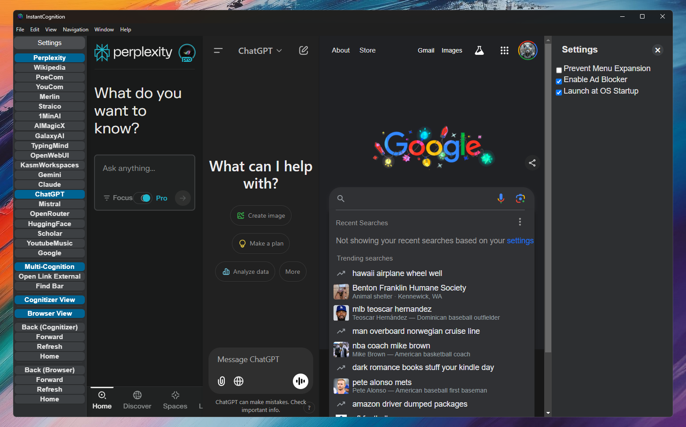

# InstantCognition v2.0+

#### Windows / MacOS / Linux - SwiftLLM is now InstantCognition!

## Why does InstantCognition exist?
Turn any web app into a native desktop app, always accessible with a simple key command, to find the information you need and get back to what you were doing before, much faster, cleaner and easier!

 

&nbsp;&nbsp;&nbsp;&nbsp;While using an AI Large Language Model (LLM), playing a game, researching a new topic, or just plain browsing the web, sometimes you need to look up some information or check a reference quickly. When you find yourself doing this often, it can turn into a slow and tedious process. First you need to open a new tab, then navigate to a website, type in a query, maybe even have to go through a couple of hoops after finding the general location of what you want, then finally accessing the information you need. InstantCognition makes this entire process tremendously faster by showing and focusing a Chromium browser instantly after hitting a simple key command (CTRL/CMD + Space), where you can immediately begin typing your query into your favorite AI like ChatGPT, a search engine like Google, or maybe even a wiki or a walkthrough for a game you're currently playing. As soon as you're finished getting all of the necessary information, hit the key command again (CTRL/CMD + Space) to hide InstantCognition and go right back to what you were doing before, instantly!!

&nbsp;&nbsp;&nbsp;&nbsp;There are many features included surrounding the idea of quick research. You can add many 'Cognitizers', with predefined tabs that are used as the 'starting point' of any research you want to do (For example: the starting page of a search engine, where you can enter your search query, or the new conversation page or an AI LLM where you can send the LLM a prompt). There is a integrated 'browser tab', which catches CTRL/CMD + Clicked links in a single tab, so you don't open many tabs just because you don't want to follow a link in the Cognitizer section. InstantCognition also comes with the option to open a link or search for text in your default web browser instead of InstantCognition's built-in browser tab, when you need to access a link in your primary web-browser. MultiCognition mode allows you to show as many Cognitizer web pages next to each other as you want, so you can copy/paste your LLM prompt into a bunch of different LLMs at once, or simply have whatever websites you like open and visible as the same time. A lot of time has been put into making everything work as you would expect, so using InstantCognition is as fast and as seamless of an experience as possible. InstantCognition is also designed with the idea of being as fast, secure and stable as possible without a bunch of useless extra features you probably won't ever need. However, there are plenty of useful options and features included too, such as a built-in adblocker, ability to launch the app when your computer is starting up, and much more!!

### All of the Coolest Features
- CTRL/CMD + Space :: Shows the InstantCognition window which lets you instantly query your favorite LLM, search engine, wiki or whatever you want. Hit the command again to instantly hide the window to go back to what you were doing before. You can disable and enable the shortcut anytime using CTRL/CMD + ALT/OPTION + L, so you can't accidentally hit the key command in a game, and also won't interfere with other apps that use CTRL/CMD + Space
- Customizable 'Cognitizer Tabs' (Improved in v2.0!) :: You can put any LLM/website and label you'd like in any order (add/remove/edit in config.json file, up to 50 Cognitizers)
- One Compact 'Browser Tab' :: Catches CTRL/CMD + Click events to open links in the right side of the window. You can also click 'Open Link External' to open the link in your default browser
- MultiCognition Mode (New in v2.0!) :: Allows you to open as many of your Cognitizer tabs side-by-side, so you can see and use multiple web apps at once
- Ad-Blocker (Improved in v2.0!) :: Ad-blocker that gets rid of all of the bad stuff but won't interfere with your favorite web apps
- Find Bar (New in v2.0!) :: Integrated like any browser text find functionality, open with CTRL/CMD + F
- Intuitive Design Philosophy (New in v2.0!) :: Large focus on making things 'just work' how you'd expect them to work, including swipe gestures. Lots of helpful functions are included in the right-click menu and context menu. Tons of polish added to various aspects to account for edge cases (scrollable menu when there are too many Cognitizers added, for example)
- Fast, Secure and Stable Code Design (Improved in v2.0!) :: Many changes have been made to improve overall performance. To name a few: Cognitizer tabs sleep when not selected, Cognitizer pages are not loaded until selected, frees up RAM used by InstantCognition aggressively, utilizes Electron which runs securely on Chromium, and much more
### Settings
- Prevent Menu Expansion: Does not expand the menu when hovering your mouse over it
- Enable Ad Blocker: Ad blocker with block lists included. Should not affect most website functionality
- Launch at OS Startup: Automatically runs InstantCognition when starting up your computer
- Open Settings Config File: Opens config.json, where all user and state settings exist
- Restart App to Apply Settings: Restarts InstantCognition, for once you've changed and saved config.json, to apply the new settings

#### NOTE: All scripts are compatible with both Ubuntu and MacOS, including Ubuntu on Windows Subsystem for Linux

## Setup Build Environment

- sudo bash setup_env.sh

## How to Build

- ./bld_and_cp.sh

Simply run the command with no arguments, which will automatically detect your OS, update NPM packages, build then copy InstantCognition to your Desktop if on Windows or your user App folder if on MacOS, and then run the App:

### Only create an OSX ARM / x64 .app file: 
- npm run package-mac-arm
- npm run package-mac-x64

### Only create a Windows ARM / x64 .exe file/folder: 
- npm run package-win-arm
- npm run package-win-x64

### Only create a Linux build file/folder: 
- npm run package-lin-arm
- npm run package-lin-x64

## Known Issues

- Some logins using a Google account don't work properly. For example, you can't login to Claude by clicking the link to login with your Google account. (NOTE: You can almost always login to an account without the official Google login)

## TODO
- Add adjustable bar between the LLM and browser webviews, so the split can be resized
    - Don't save and load this setting
- Add keyboard shortcuts to go between LLMs, but only put these shortcuts into effect if the window is focused (not global)
    - Shortcuts all start with ctrl + shift. Up and down would go through the list. Specific key letters could be added for specific LLMs (C for Copilot, G for Gemini, etc)
    - Add settings for modifier (ctrl + shift) and to customize the letter for specific LLMs
- Develop ability to package the app into a single .exe file, to make it portable.
    - The settings config.json and other files will be saved next to the portable .exe file
- Implement automatic updating
    - First implementation could be crude, like just redownloading from a new release
- Ensure all account types can login to all supported LLMs
    - Email login / google login / facebook login / etc
- Design unit tests and system tests for the release workflow
