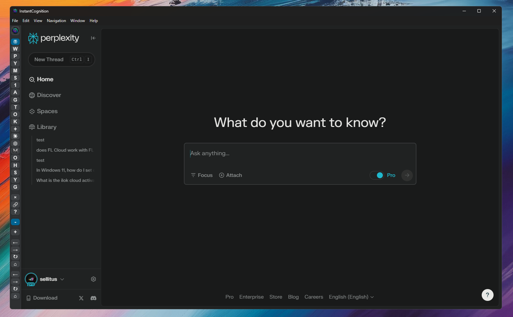

# InstantCognition v3.0




**Cross-platform desktop app for instant access to AI LLMs and web apps**

Windows | MacOS | Linux

Press **CTRL/CMD + Space** to instantly show/hide your favorite AI assistants (ChatGPT, Gemini, Claude, etc.) and web tools. Get answers fast without switching contexts or managing browser tabs.

## Key Features

- **Global Hotkey** - CTRL/CMD + Space to show/hide instantly
- **Modern Settings UI** - Tabbed interface (General, Shortcuts, Cognitizers, Appearance)
- **Customizable Cognitizers** - Add any AI LLM or website with custom labels (up to 50)
- **MultiCognition Mode** - View multiple AI assistants side-by-side
- **Integrated Browser** - CTRL/CMD + Click opens links in compact browser tab
- **Built-in Ad Blocker** - Clean browsing without distractions
- **Find in Page** - CTRL/CMD + F text search
- **Launch at Startup** - Optional auto-start with your system

## Quick Start

### Download & Run
Download the latest release for your platform and run the app.

### Settings
Access Settings from the app menu to customize:
- Window behavior and startup options
- Keyboard shortcuts
- Your cognitizers (AI LLMs and web apps)
- Theme and appearance

Changes apply instantly with the "Apply/Restart" button.

---

## For Developers

### Tech Stack
- **Electron** 36.4.0
- **JavaScript** with TypeScript type checking
- **Jest** testing framework
- Built with electron-builder

### Development Commands

```bash
# Install dependencies
npm install --legacy-peer-deps

# Run in development
npm start

# Run tests
npm test

# Lint & format
npm run lint
npm run fix

# Build for your platform
./bld_and_cp.sh
```

### Project Structure

```
InstantCognition/
├── main.js              # Entry point
├── index.html           # Main window
├── main/                # Main process (backend)
│   ├── index.js        # App lifecycle & IPC
│   ├── services/       # Core services
│   └── utils/          # Config, logging, errors
├── renderer/            # Renderer process (UI)
│   ├── renderer.js     # UI logic
│   ├── components/     # Sidebar, Settings
│   └── styles/         # CSS & themes
├── tests/               # Jest test suite
├── scripts/             # Build utilities
└── assets/              # Icons & images
```

### Build Commands

**Auto-detect platform:**
```bash
./bld_and_cp.sh
```

**Platform-specific:**
```bash
npm run package-mac-arm
npm run package-mac-x64
npm run package-win-x64
npm run package-lin-x64
```

### Configuration
User settings are stored in `config.json` (auto-generated, gitignored).

See **CLAUDE.md** for detailed architecture documentation.

---

## License

MIT License - See LICENSE file for details
